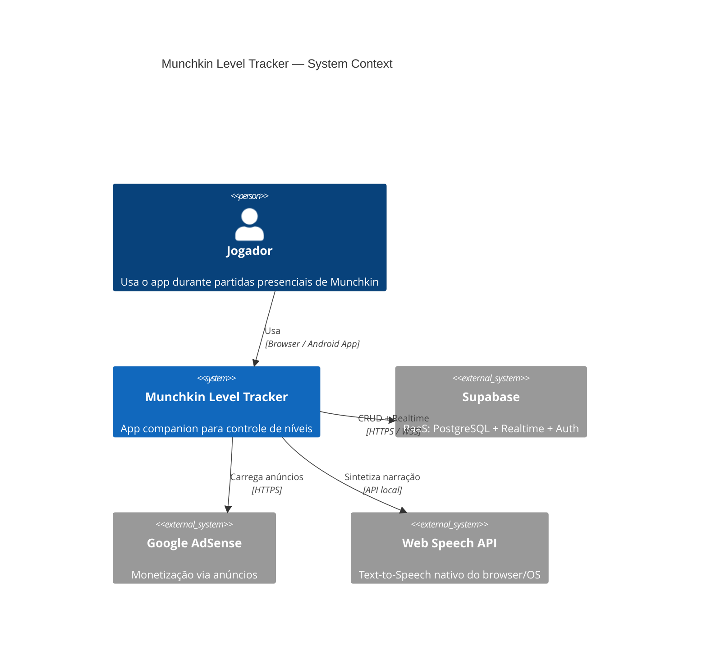
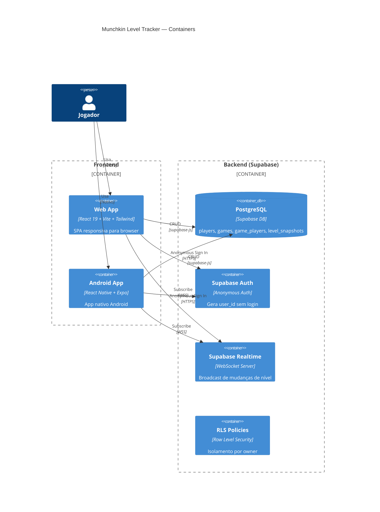
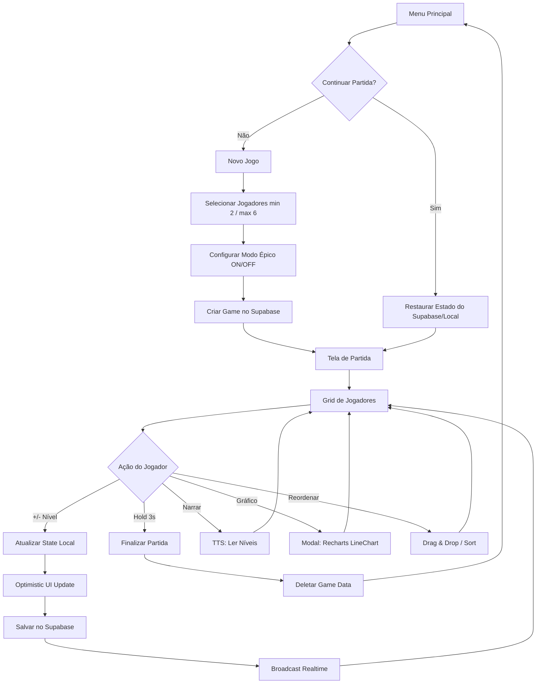
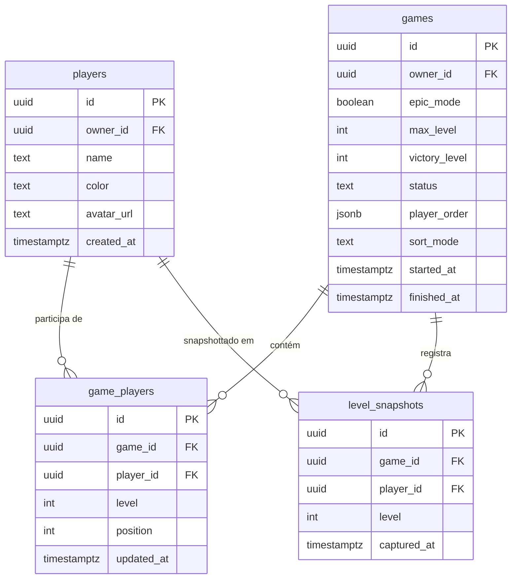

# Fullstack Architecture — Munchkin Level Tracker

**Versão:** 1.0
**Data:** 2026-04-08
**Autor:** Aria (@architect)
**Status:** Aprovado para Desenvolvimento

---

## Índice

1. [Tech Stack Decision](#1-tech-stack-decision)
2. [System Architecture Diagram](#2-system-architecture-diagram)
3. [Database Schema](#3-database-schema)
4. [API Design](#4-api-design)
5. [Frontend Architecture](#5-frontend-architecture)
6. [Realtime Strategy](#6-realtime-strategy)
7. [Offline Strategy](#7-offline-strategy)
8. [Security](#8-security)
9. [Epics & Stories Breakdown](#9-epics--stories-breakdown)

---

## 1. Tech Stack Decision

### 1.1 Frontend Web — React 19 + Vite

| Critério | Decisão | Justificativa |
|----------|---------|---------------|
| Framework | **React 19** | Ecossistema maduro, pool de bibliotecas imenso (Recharts, dnd-kit, Zustand). PRD define React explicitamente. |
| Bundler | **Vite 6** | HMR instantâneo, build rápido com Rollup, zero-config para React + TypeScript. |
| Styling | **Tailwind CSS 4** | Front-End Spec define tokens e classes Tailwind. Utility-first acelera implementação. |
| Linguagem | **TypeScript 5.5+** | Type safety end-to-end. Integração nativa com Supabase types. |

### 1.2 Frontend Mobile — React Native (Expo)

| Critério | Decisão | Justificativa |
|----------|---------|---------------|
| Framework | **React Native via Expo SDK 52** | Reutiliza conhecimento React da equipe. Expo simplifica build Android. |
| Navegação | **Expo Router v4** | File-based routing, deep linking nativo. |
| Styling RN | **NativeWind 4** | Tailwind para React Native. Reutiliza tokens do design system. |
| Animações | **React Native Reanimated 3** | Animações no UI thread (60fps). Necessário para level bump e drag & drop fluidos. |

### 1.3 Backend — Supabase (BaaS)

| Critério | Decisão | Justificativa |
|----------|---------|---------------|
| BaaS | **Supabase** (PostgreSQL 15) | PRD define explicitamente. Plano free suporta MVP. SDK JS/TS de primeira classe. |
| Auth | **Supabase Auth (anônimo)** | Sem tela de login. Anonymous auth gera `user_id` que isola partidas. |
| Realtime | **Supabase Realtime (Postgres Changes)** | WebSocket nativo integrado ao DB. Usado em V2 para multiplayer. |

### 1.4 State Management — Zustand

**Decisão:** Zustand 5 com `persist` middleware.

Leve (1.1KB), sem boilerplate. `persist` integra com `localStorage` (web) e `AsyncStorage` (RN) sem código adicional.

### 1.5 Bibliotecas Chave

| Biblioteca | Versão | Propósito |
|-----------|--------|-----------|
| `@supabase/supabase-js` | ^2.45 | Client SDK para DB, Auth e Realtime |
| `zustand` | ^5.0 | State management |
| `@dnd-kit/core` + `@dnd-kit/sortable` | ^6.1 | Drag & Drop (web) |
| `react-native-draggable-flatlist` | ^4.0 | Drag & Drop (RN) |
| `recharts` | ^2.12 | Gráfico de progresso (web) |
| `victory-native` | ^41 | Gráfico de progresso (RN) |
| `@phosphor-icons/react` | ^2.1 | Iconografia |
| `sonner` | ^1.7 | Toast notifications (web) |

### 1.6 Monetização

| Plataforma | Solução | Nota |
|-----------|---------|------|
| Web | **Google AdSense** | Banner no menu principal. Nenhum ad na tela de partida. |
| Android | **Google AdMob** | Futuro V2, após publicação na Play Store. |

### 1.7 Hosting & Deploy

| Critério | Decisão |
|----------|---------|
| Web Hosting | **Vercel** — deploy automático via Git push. Free tier suporta MVP. |
| Mobile Build | **EAS Build (Expo)** — build na nuvem, distribuição via APK ou Play Store. |
| CI/CD | **GitHub Actions** — lint + typecheck + testes no PR, deploy automático no merge. |

---

## 2. System Architecture Diagram

### 2.1 C4 — Context Level



### 2.2 C4 — Container Level



### 2.3 Flowchart — Fluxo Principal



---

## 3. Database Schema

### 3.1 ERD



### 3.2 SQL — DDL Completo

```sql
-- =============================================================
-- TABELA: players
-- =============================================================
CREATE TABLE public.players (
    id         UUID PRIMARY KEY DEFAULT gen_random_uuid(),
    owner_id   UUID NOT NULL DEFAULT auth.uid(),
    name       TEXT NOT NULL CHECK (char_length(name) BETWEEN 1 AND 30),
    color      TEXT NOT NULL CHECK (color ~ '^#[0-9a-fA-F]{6}$'),
    avatar_url TEXT,
    created_at TIMESTAMPTZ NOT NULL DEFAULT now()
);

CREATE INDEX idx_players_owner ON public.players (owner_id);

-- =============================================================
-- TABELA: games
-- =============================================================
CREATE TABLE public.games (
    id            UUID PRIMARY KEY DEFAULT gen_random_uuid(),
    owner_id      UUID NOT NULL DEFAULT auth.uid(),
    epic_mode     BOOLEAN NOT NULL DEFAULT false,
    max_level     INT GENERATED ALWAYS AS (CASE WHEN epic_mode THEN 20 ELSE 10 END) STORED,
    victory_level INT GENERATED ALWAYS AS (CASE WHEN epic_mode THEN 21 ELSE 11 END) STORED,
    status        TEXT NOT NULL DEFAULT 'active' CHECK (status IN ('active', 'finished')),
    player_order  JSONB NOT NULL DEFAULT '[]'::jsonb,
    sort_mode     TEXT NOT NULL DEFAULT 'level-desc' CHECK (sort_mode IN ('level-desc', 'random', 'custom')),
    started_at    TIMESTAMPTZ NOT NULL DEFAULT now(),
    finished_at   TIMESTAMPTZ
);

-- Apenas uma partida ativa por owner
CREATE UNIQUE INDEX idx_games_active_owner
    ON public.games (owner_id) WHERE status = 'active';

CREATE INDEX idx_games_owner_status ON public.games (owner_id, status);

-- =============================================================
-- TABELA: game_players
-- =============================================================
CREATE TABLE public.game_players (
    id         UUID PRIMARY KEY DEFAULT gen_random_uuid(),
    game_id    UUID NOT NULL REFERENCES public.games (id) ON DELETE CASCADE,
    player_id  UUID NOT NULL REFERENCES public.players (id) ON DELETE CASCADE,
    level      INT NOT NULL DEFAULT 1 CHECK (level >= 1),
    position   INT NOT NULL DEFAULT 0,
    updated_at TIMESTAMPTZ NOT NULL DEFAULT now(),

    UNIQUE (game_id, player_id)
);

CREATE INDEX idx_game_players_game ON public.game_players (game_id);

CREATE OR REPLACE FUNCTION update_game_players_timestamp()
RETURNS TRIGGER AS $$
BEGIN
    NEW.updated_at = now();
    RETURN NEW;
END;
$$ LANGUAGE plpgsql;

CREATE TRIGGER trg_game_players_updated
    BEFORE UPDATE ON public.game_players
    FOR EACH ROW
    EXECUTE FUNCTION update_game_players_timestamp();

-- =============================================================
-- TABELA: level_snapshots
-- =============================================================
CREATE TABLE public.level_snapshots (
    id          UUID PRIMARY KEY DEFAULT gen_random_uuid(),
    game_id     UUID NOT NULL REFERENCES public.games (id) ON DELETE CASCADE,
    player_id   UUID NOT NULL REFERENCES public.players (id) ON DELETE CASCADE,
    level       INT NOT NULL CHECK (level >= 1),
    captured_at TIMESTAMPTZ NOT NULL DEFAULT now()
);

CREATE INDEX idx_snapshots_game_time
    ON public.level_snapshots (game_id, captured_at);

-- =============================================================
-- REALTIME: habilitar nas tabelas necessárias
-- =============================================================
ALTER PUBLICATION supabase_realtime ADD TABLE public.game_players;
ALTER PUBLICATION supabase_realtime ADD TABLE public.games;
```

### 3.3 Decisões de Schema

| Decisão | Racional |
|---------|----------|
| `max_level` e `victory_level` como computed columns | DB é fonte de verdade, sem lógica duplicada no frontend. |
| `player_order` como JSONB | Array de UUIDs para drag & drop sem tabela auxiliar. |
| Unique index parcial `WHERE status = 'active'` | Garante no máximo 1 partida ativa por device/user. |
| `ON DELETE CASCADE` em game_players e snapshots | Finalizar partida (delete game) limpa todos os dados relacionados automaticamente. |
| `level_snapshots` separada | Série temporal imutável, não polui o estado atual. |

---

## 4. API Design

### 4.1 Inicialização do Client

```typescript
// lib/supabase.ts
import { createClient } from '@supabase/supabase-js';
import type { Database } from './database.types';

export const supabase = createClient<Database>(
    import.meta.env.VITE_SUPABASE_URL,
    import.meta.env.VITE_SUPABASE_ANON_KEY
);
```

### 4.2 Auth — Anonymous Sign In

```typescript
// services/auth.ts
export async function ensureAnonymousSession(): Promise<string> {
    const { data: { session } } = await supabase.auth.getSession();
    if (session) return session.user.id;

    const { data, error } = await supabase.auth.signInAnonymously();
    if (error) throw error;
    return data.user.id;
}
```

### 4.3 Players CRUD

```typescript
// services/players.ts
export async function getPlayers(): Promise<Player[]> {
    const { data, error } = await supabase
        .from('players')
        .select('*')
        .order('created_at', { ascending: true });
    if (error) throw error;
    return data;
}

export async function createPlayer(name: string, color: string): Promise<Player> {
    const { data, error } = await supabase
        .from('players')
        .insert({ name, color })
        .select()
        .single();
    if (error) throw error;
    return data;
}

export async function deletePlayer(id: string): Promise<void> {
    const { error } = await supabase.from('players').delete().eq('id', id);
    if (error) throw error;
}
```

### 4.4 Game Lifecycle

```typescript
// services/games.ts
export async function createGame(playerIds: string[], epicMode: boolean): Promise<Game> {
    const { data: game, error: gameError } = await supabase
        .from('games')
        .insert({ epic_mode: epicMode, player_order: playerIds })
        .select()
        .single();
    if (gameError) throw gameError;

    const gamePlayers = playerIds.map((playerId, index) => ({
        game_id: game.id,
        player_id: playerId,
        level: 1,
        position: index,
    }));

    const { error: gpError } = await supabase.from('game_players').insert(gamePlayers);
    if (gpError) throw gpError;

    return game;
}

export async function getActiveGame(): Promise<GameWithPlayers | null> {
    const { data, error } = await supabase
        .from('games')
        .select(`*, game_players (*, player:players (*))`)
        .eq('status', 'active')
        .maybeSingle();
    if (error) throw error;
    return data;
}

export async function finishGame(gameId: string): Promise<void> {
    const { error } = await supabase.from('games').delete().eq('id', gameId);
    if (error) throw error;
}
```

### 4.5 Level Operations

```typescript
// services/levels.ts
export async function updateLevel(gamePlayerId: string, newLevel: number): Promise<void> {
    const { error } = await supabase
        .from('game_players')
        .update({ level: newLevel })
        .eq('id', gamePlayerId);
    if (error) throw error;
}

export async function captureSnapshot(gameId: string, players: GamePlayer[]): Promise<void> {
    const snapshots = players.map(p => ({
        game_id: gameId,
        player_id: p.player_id,
        level: p.level,
    }));
    const { error } = await supabase.from('level_snapshots').insert(snapshots);
    if (error) throw error;
}

export async function getSnapshots(gameId: string): Promise<LevelSnapshot[]> {
    const { data, error } = await supabase
        .from('level_snapshots')
        .select('*')
        .eq('game_id', gameId)
        .order('captured_at', { ascending: true });
    if (error) throw error;
    return data;
}
```

### 4.6 Realtime Subscriptions (V2 — Multiplayer)

```typescript
// services/realtime.ts
export function subscribeToGameLevels(
    gameId: string,
    onLevelChange: (payload: RealtimePayload) => void
): RealtimeChannel {
    return supabase
        .channel(`game-${gameId}-levels`)
        .on('postgres_changes', {
            event: 'UPDATE',
            schema: 'public',
            table: 'game_players',
            filter: `game_id=eq.${gameId}`,
        }, onLevelChange)
        .subscribe();
}
```

---

## 5. Frontend Architecture

### 5.1 Monorepo Structure

```
munchkin-level-tracker/
├── apps/
│   ├── web/                          # React 19 + Vite
│   │   └── src/
│   │       ├── app/                  # Rotas (React Router v7)
│   │       │   ├── layout.tsx        # Layout raiz
│   │       │   ├── page.tsx          # Menu Principal (/)
│   │       │   ├── new-game/page.tsx # Stepper (/new-game)
│   │       │   └── game/page.tsx     # Tela de Partida (/game)
│   │       ├── components/           # Componentes UI
│   │       │   ├── PlayerCard/
│   │       │   ├── PlayerGrid/
│   │       │   ├── LevelButton/
│   │       │   ├── EpicModeToggle/
│   │       │   ├── HoldButton/
│   │       │   ├── QuickAddPlayer/
│   │       │   ├── AppHeader/
│   │       │   ├── SortDropdown/
│   │       │   ├── NarratorButton/
│   │       │   ├── ProgressChart/
│   │       │   └── AdBanner/
│   │       ├── hooks/
│   │       │   ├── useGameStore.ts
│   │       │   ├── useRealtime.ts
│   │       │   ├── useAutoSave.ts
│   │       │   ├── useSnapshotTimer.ts
│   │       │   └── useTTS.ts
│   │       └── main.tsx
│   │
│   └── mobile/                       # React Native + Expo
│       └── app/
│           ├── index.tsx             # Menu Principal
│           ├── new-game.tsx
│           └── game.tsx
│
├── packages/
│   └── shared/                       # Código compartilhado web + mobile
│       └── src/
│           ├── types.ts
│           ├── constants.ts
│           ├── services/             # Supabase services
│           └── store/
│               └── gameStore.ts      # Zustand store
│
├── supabase/
│   ├── migrations/
│   │   └── 001_initial_schema.sql
│   └── config.toml
│
└── package.json                      # npm workspaces
```

### 5.2 Zustand Store — Pattern Optimistic UI

```typescript
// packages/shared/src/store/gameStore.ts
updateLevel: (gamePlayerId, delta) => {
    const { gamePlayers, activeGame } = get();
    const player = gamePlayers.find(p => p.id === gamePlayerId);
    if (!player || !activeGame) return;

    const newLevel = player.level + delta;

    // Guard: respeitar limites
    if (newLevel < 1 || newLevel > activeGame.max_level) return;

    // 1. Update local INSTANTÂNEO (< 100ms — NFR atendido)
    set(state => ({
        gamePlayers: state.gamePlayers.map(p =>
            p.id === gamePlayerId ? { ...p, level: newLevel } : p
        ),
    }));

    // 2. Persist no Supabase (async, com rollback em falha)
    levelsService.updateLevel(gamePlayerId, newLevel).catch(() => {
        set(state => ({
            gamePlayers: state.gamePlayers.map(p =>
                p.id === gamePlayerId ? { ...p, level: player.level } : p
            ),
        }));
    });
},
```

---

## 6. Realtime Strategy

### 6.1 MVP vs V2

| Fase | Uso de Realtime | Justificativa |
|------|----------------|---------------|
| **MVP** | **Desabilitado** | Partida controlada por 1 dispositivo. Realtime é overhead. |
| **V2** | **Habilitado** | Multiplayer: múltiplos devices na mesma partida. |

### 6.2 MVP — Local-First com Supabase como Backup

```
[User toca +/-] → [Optimistic UI] → [Supabase UPSERT async] → [Local state = source of truth]
```

### 6.3 V2 — Conflict Resolution: Last Write Wins (LWW)

Em Munchkin, conflitos de nível são raros (cada jogador controla seu próprio nível). LWW é simples, correto e suficiente — CRDTs seriam over-engineering.

### 6.4 Snapshot Timer (Gráfico)

```typescript
// hooks/useSnapshotTimer.ts
useEffect(() => {
    if (!activeGame) return;
    captureSnapshot(activeGame.id, gamePlayers); // snapshot inicial

    const interval = setInterval(() => {
        captureSnapshot(activeGame.id, gamePlayers);
    }, 15 * 60 * 1000); // 15 min

    return () => clearInterval(interval);
}, [activeGame?.id]);
```

---

## 7. Offline Strategy

### 7.1 Local-First com Cloud Backup

```
[Level change] → [Zustand RAM] → [localStorage persist] → [Supabase async]
                  ↑ source of truth   ↑ fallback offline    ↑ cloud backup
```

### 7.2 Zustand Persist

```typescript
export const useGameStore = create<GameState>()(
    persist(
        (set, get) => ({ /* ... */ }),
        {
            name: 'munchkin-game-store',
            storage: createJSONStorage(() => localStorage), // AsyncStorage no RN
            partialize: (state) => ({
                userId: state.userId,
                players: state.players,
                activeGame: state.activeGame,
                gamePlayers: state.gamePlayers,
                sortMode: state.sortMode,
            }),
        }
    )
);
```

### 7.3 Restauração de Estado ao Abrir App

```
1. Ler localStorage/AsyncStorage (instantâneo)
2. Anonymous auth no Supabase
3. Se online: buscar state do Supabase
4. Comparar timestamps: mais recente vence
5. Flush sync queue de writes pendentes
6. Renderizar UI
```

---

## 8. Security

### 8.1 RLS Policies

```sql
ALTER TABLE public.players ENABLE ROW LEVEL SECURITY;
ALTER TABLE public.games ENABLE ROW LEVEL SECURITY;
ALTER TABLE public.game_players ENABLE ROW LEVEL SECURITY;
ALTER TABLE public.level_snapshots ENABLE ROW LEVEL SECURITY;

-- players: owner vê apenas seus jogadores
CREATE POLICY "players_select_own" ON public.players FOR SELECT USING (owner_id = auth.uid());
CREATE POLICY "players_insert_own" ON public.players FOR INSERT WITH CHECK (owner_id = auth.uid());
CREATE POLICY "players_update_own" ON public.players FOR UPDATE USING (owner_id = auth.uid());
CREATE POLICY "players_delete_own" ON public.players FOR DELETE USING (owner_id = auth.uid());

-- games: owner vê apenas suas partidas
CREATE POLICY "games_select_own" ON public.games FOR SELECT USING (owner_id = auth.uid());
CREATE POLICY "games_insert_own" ON public.games FOR INSERT WITH CHECK (owner_id = auth.uid());
CREATE POLICY "games_update_own" ON public.games FOR UPDATE USING (owner_id = auth.uid());
CREATE POLICY "games_delete_own" ON public.games FOR DELETE USING (owner_id = auth.uid());

-- game_players: acesso via ownership do game pai
CREATE POLICY "game_players_select_via_game" ON public.game_players FOR SELECT
    USING (EXISTS (SELECT 1 FROM public.games WHERE id = game_id AND owner_id = auth.uid()));

CREATE POLICY "game_players_insert_via_game" ON public.game_players FOR INSERT
    WITH CHECK (EXISTS (SELECT 1 FROM public.games WHERE id = game_id AND owner_id = auth.uid()));

CREATE POLICY "game_players_update_via_game" ON public.game_players FOR UPDATE
    USING (EXISTS (SELECT 1 FROM public.games WHERE id = game_id AND owner_id = auth.uid()));

CREATE POLICY "game_players_delete_via_game" ON public.game_players FOR DELETE
    USING (EXISTS (SELECT 1 FROM public.games WHERE id = game_id AND owner_id = auth.uid()));

-- level_snapshots: acesso via ownership do game pai
CREATE POLICY "snapshots_select_via_game" ON public.level_snapshots FOR SELECT
    USING (EXISTS (SELECT 1 FROM public.games WHERE id = game_id AND owner_id = auth.uid()));

CREATE POLICY "snapshots_insert_via_game" ON public.level_snapshots FOR INSERT
    WITH CHECK (EXISTS (SELECT 1 FROM public.games WHERE id = game_id AND owner_id = auth.uid()));
```

### 8.2 Validação de Nível no DB

```sql
CREATE OR REPLACE FUNCTION check_level_limit()
RETURNS TRIGGER AS $$
DECLARE game_max_level INT;
BEGIN
    SELECT max_level INTO game_max_level FROM public.games WHERE id = NEW.game_id;
    IF NEW.level > game_max_level THEN
        RAISE EXCEPTION 'Level % exceeds max_level %', NEW.level, game_max_level;
    END IF;
    IF NEW.level < 1 THEN
        RAISE EXCEPTION 'Level cannot be less than 1';
    END IF;
    RETURN NEW;
END;
$$ LANGUAGE plpgsql;

CREATE TRIGGER trg_check_level_limit
    BEFORE INSERT OR UPDATE ON public.game_players
    FOR EACH ROW EXECUTE FUNCTION check_level_limit();
```

### 8.3 Princípios de Segurança

| Princípio | Implementação |
|-----------|---------------|
| Least Privilege | `anon` key exposta tem acesso apenas via RLS. Sem `service_role` no frontend. |
| Defense in Depth | Validação: frontend (Zustand guard) + DB trigger + DB constraint. |
| Data Isolation | RLS cascateia via `owner_id` — nenhum user vê dados de outro. |
| No Sensitive Data | Anonymous auth: sem email/senha armazenados. |
| Input Sanitization | `name` limitado a 30 chars no DB, `color` validado por regex hex. |

---

## 9. Epics & Stories Breakdown

### EP-01: Setup & Infraestrutura (14 pts)

| Story ID | Título | Pts |
|----------|--------|-----|
| EP01-S01 | Setup do monorepo e tooling | 3 |
| EP01-S02 | Setup Supabase project | 2 |
| EP01-S03 | Migração inicial do banco | 3 |
| EP01-S04 | Anonymous Auth flow | 2 |
| EP01-S05 | Design System base (Tailwind) | 2 |
| EP01-S06 | CI/CD pipeline | 2 |

### EP-02: Gerenciamento de Jogadores (10 pts)

| Story ID | Título | Pts |
|----------|--------|-----|
| EP02-S01 | Tela de Gestão de Jogadores | 3 |
| EP02-S02 | Cadastro de jogador | 3 |
| EP02-S03 | Remoção de jogador | 2 |
| EP02-S04 | Cadastro rápido inline (New Game) | 2 |

### EP-03: Fluxo de Novo Jogo (13 pts)

| Story ID | Título | Pts |
|----------|--------|-----|
| EP03-S01 | Menu Principal | 3 |
| EP03-S02 | Stepper Step 1 — Seleção de Jogadores | 3 |
| EP03-S03 | Stepper Step 2 — Configuração Modo Épico | 2 |
| EP03-S04 | Criar Game no Supabase | 3 |
| EP03-S05 | Continuar Partida | 2 |

### EP-04: Tela de Partida — Core (19 pts)

| Story ID | Título | Pts |
|----------|--------|-----|
| EP04-S01 | PlayerCard component | 5 |
| EP04-S02 | LevelButton com feedback tátil | 3 |
| EP04-S03 | PlayerGrid responsivo | 3 |
| EP04-S04 | Detecção de líder e vitória | 2 |
| EP04-S05 | AppHeader da partida | 2 |
| EP04-S06 | Finalizar partida (HoldButton 3s) | 3 |
| EP04-S07 | Animações de entrada (stagger) | 1 |

### EP-05: Persistência & Salvamento (14 pts)

| Story ID | Título | Pts |
|----------|--------|-----|
| EP05-S01 | Zustand store com persist middleware | 3 |
| EP05-S02 | Auto-save no Supabase | 3 |
| EP05-S03 | Sync queue offline | 3 |
| EP05-S04 | Restauração de estado ao abrir app | 3 |
| EP05-S05 | Limpeza de dados ao finalizar | 2 |

### EP-06: Narração TTS (8 pts) — V1

| Story ID | Título | Pts |
|----------|--------|-----|
| EP06-S01 | Hook useTTS | 3 |
| EP06-S02 | NarratorButton | 2 |
| EP06-S03 | Modal de Configurações — Voz | 2 |
| EP06-S04 | Narração automática de vitória | 1 |

### EP-07: Gráfico de Progresso (8 pts) — V1

| Story ID | Título | Pts |
|----------|--------|-----|
| EP07-S01 | Timer de snapshots (15min) | 2 |
| EP07-S02 | Modal ProgressChart (Recharts) | 5 |
| EP07-S03 | Botão de gráfico na barra | 1 |

### EP-08: Ordenação & Drag & Drop (12 pts) — V1

| Story ID | Título | Pts |
|----------|--------|-----|
| EP08-S01 | SortDropdown | 2 |
| EP08-S02 | Drag & Drop com @dnd-kit | 5 |
| EP08-S03 | Auto-sort por nível | 3 |
| EP08-S04 | Reordenação por teclado (acessibilidade) | 2 |

### Resumo

| Épico | Pts | Fase |
|-------|-----|------|
| EP-01: Setup & Infraestrutura | 14 | MVP |
| EP-02: Gerenciamento de Jogadores | 10 | MVP |
| EP-03: Fluxo de Novo Jogo | 13 | MVP |
| EP-04: Tela de Partida — Core | 19 | MVP |
| EP-05: Persistência & Salvamento | 14 | MVP |
| EP-06: Narração TTS | 8 | V1 |
| EP-07: Gráfico de Progresso | 8 | V1 |
| EP-08: Ordenação & Drag & Drop | 12 | V1 |
| **TOTAL** | **98** | |

### Ordem de Execução

```
EP-01 → EP-02 → EP-03 → EP-04 → EP-05
                                    ↓
                         EP-06, EP-07, EP-08 (paralelos)
```

---

*Fullstack Architecture — Munchkin Level Tracker v1.0 | @architect (Aria)*
